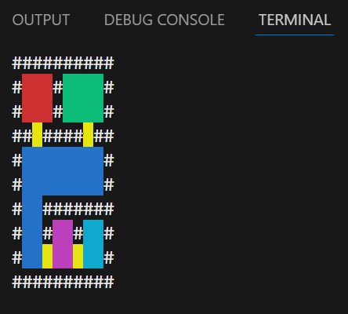

# Exámen Técnico

## Habitaciones coloreadas

Un plano de planta es una representación abstracta del piso de un edificio y está definido por la distribución de las paredes y el espacio. Para este proyecto, los planos de planta están representados por caracteres ASCII, con paredes siendo "#" y espacios vacíos siendo " " (espacio en blanco).

Una habitación está definida por un grupo de espacios adyacentes rodeados por paredes y puertas. Una puerta se define por un único espacio que divide dos paredes colineales.

Aquí hay un ejemplo simple de un piso con 5 habitaciones:

```
##########
#   #    #
#   #    #
## #### ##
#        #
#        #
#  #######
#  #  #  #
#        #
##########
```

Queremos que las habitaciones se distingan fácilmente entre sí mediante el uso de colores.

Escriba una pieza de software simple que reciba un plano de planta ASCII e imprima una representación agradable, hermosa y colorida de el plano de planta con las habitaciones coloreadas.

## Solución



La solución se organiza en tres componentes principales:

- Structure
- Reader
- Printer

### Structure

Este componente almacena las posiciones y puede determinar cuáles de esas posiciones son:

- paredes
- puertas
- habitaciones

### Reader

El Reader se encarga de leer las posiciones que serán cargadas en la Structure. Soporta múltiples implementaciones, lo que permite leer las posiciones desde distintas fuentes. El código se entrega con una implementación simple que lee posiciones desde un string hardcodeado.

### Printer

El Printer se encarga de imprimir una matriz de objetos. Soporta múltiples implementaciones, lo que permite realizar la impresión en distintos destinos. El código se entrega con una implementación simple que imprime en consola.

## Tecnología

La solución está realizada en JavaScript, ejecutándose en el entorno de Node.js, con tests automatizados usando Jest.

Nota: Quedaron fuera de los tests los Readers y Printers, ya que se consideran componentes de entrada/salida y no de lógica principal.

## Comandos

### Instatacion

```
npm i
```

### Ejecución

```
npm start
```

### Test con Coverage

```
npm test -- --coverage
```
